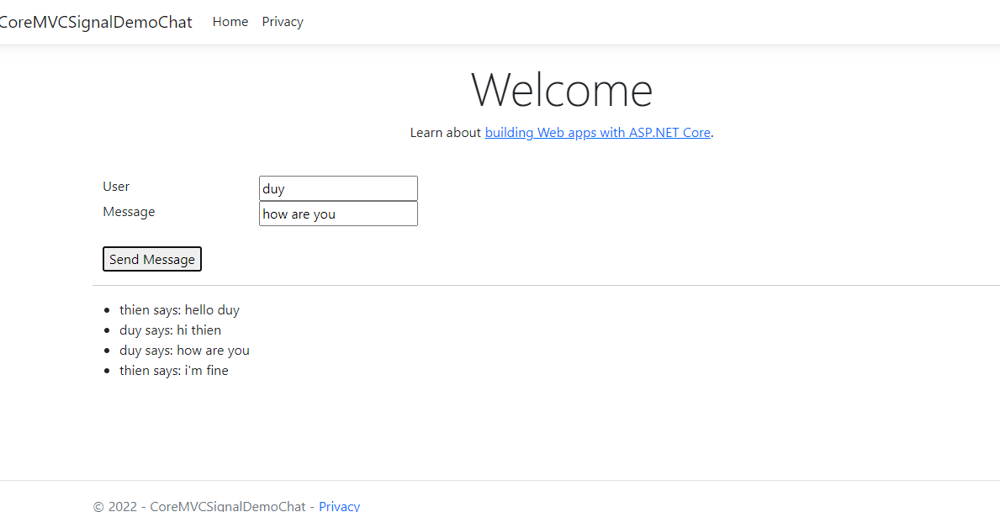

# SIgnalR

# CoreMVCSignalDemoChat

## Libraries
```c#
PS G:\Git\SignalR\CoreMVCSignalDemoChat\CoreMVCSignalDemoChat> dotnet add package Microsoft.AspNetCore.SignalR 
```

## Demo
<div align="center">
  
</div>